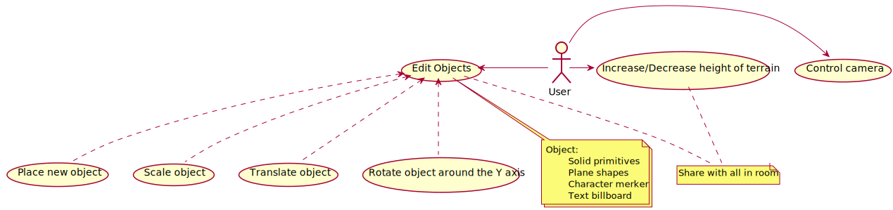
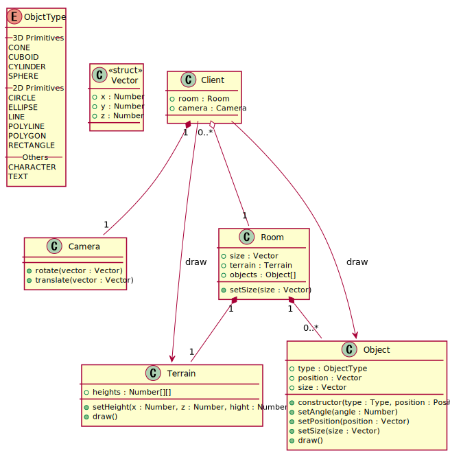
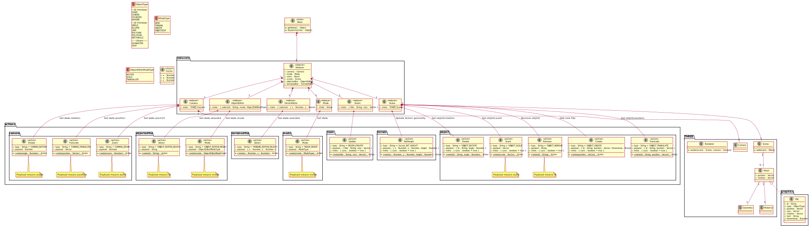
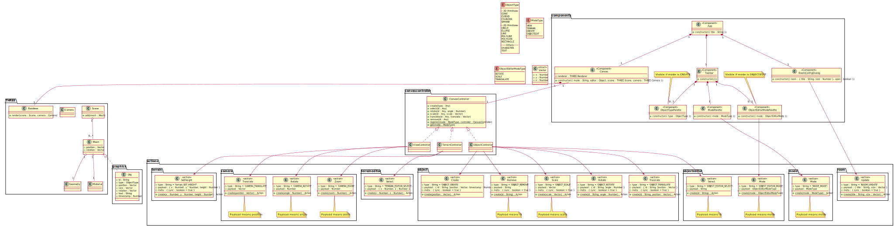

# Design of Nekovision

```sh
java -jar plantuml.jar -v -o ../dist -tsvg ./src/*.uml
```

## Usecase
[](dist/usecase.svg)

## Class

### Concept
[](dist/class1.svg)

### Redux
[](dist/class-redux.svg)

### React Components
[](dist/class-components.svg)
